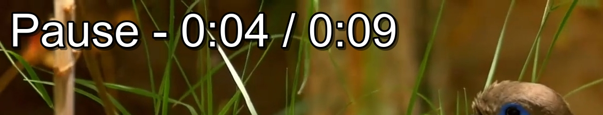

# Video-Selector-Player
A python application which uses the tkinter binding to enable selecting and playing saved Films and TV Shows. It provides an attractive environment to select videos to watch as well as  displaying any partially watched or the next up in any series. The application was primarily designed to be displayed on a television and controlled using its remote, more information on this can be found in [this section](#using-with-tv-remote-control). 

https://user-images.githubusercontent.com/126174941/220942268-6e789f40-f0dd-4e60-a39e-445f597f0094.mp4

## Prerequisites
Before the application runs, [FFmpeg](https://ffmpeg.org/) and [VLC](https://www.videolan.org/) must be installed. These are used to create the video thumbnails and play the videos respectively. On Debian-based Linux distributions (e.g. Ubuntu and Raspberry Pi OS) these can installed with:
```
sudo apt install ffmpeg
sudo apt install vlc
```

In addition, some python packages are needed:

`natsort, Pillow, ffmpeg-python, and python-vlc`

These can be installed using [**PIP**](https://pypi.org/project/pip/), with the command `pip install` followed by the package name.

### Mounting network drives
If you are using a network drive they can be mounted on Debian-based systems using:

`sudo mount -r -t cifs -o username=USERNAME,password=PASSWORD NETWORK_LOCATION .`

This will mount the network drive in the current location. To avoid needing to do this each time the system boots you can add in `/etc/fstab`, the line:

`NETWORK_LOCATION LOCAL_FOLDER cifs vers=1.0,user=USERNAME,password=PASSWORD,x-systemd.automount 0 0`


# Quickstart 
A brief guide explaining how to set up and use the application.

## Setup
Before running for the first time put top-level folders which contain videos in the file [base_directories.txt](data/base_directories.txt), with each folder on a new line. These folders will become the video categories. Then run [main.py](main.py), the application will guide you through the setup and launch the GUI.

## Usage
Navigate using the arrow keys: press enter to select a folder or to play a video and backspace to go back one folder or to stop play. When playing a video; enter can be pressed to play or pause. The next-up videos will be added to a feature on the home screen. If you need more help or want to explore the features have a look at the full guide.

# Features and usage guide
Here is a more comprehensive explanation of the application’s features is presented.

## Preparation
This is a guide to preparing video folder structures and telling the application where to find them.

### Folder Structure
The application is designed to simulate folder structures however they are organised, with top level directories becoming categories on the home screen. However, there are constraints on this, which are:

- No folders containing a mixture of video files and folders; video files organised like this will not be recognised by the application.

- No empty folders; the application will exit if it finds any. 

An example a of compatible structure is given below. The folders "Nature Clips" and "Public Domain" serve as the categories.


### Setting Folder Locations
The top-level folders, which will become the video categories, are added as lines to a file [database_directories.txt](data/base_directories.txt). After this is done, you can run [main.py](main.py) to scan for video files. Alternatively, when running for the first time the application can guide you through adding these folders.

### Scanning
Before the GUI runs for the first time, the application will: scan the specified folders for video files, make thumbnail images of these files, and save them to the folder [thumbnails/fixed_position](data/thumbnails/fixed_position). It will also scan the directory structure into an object and when it is complete save it to the file [folder_structure.pickle](data/folder_structure.pickle).


## Video selection
In this section selecting video files is discussed. What follows will hopefully be intuitive for the user and the application should be able to be used without a careful consultation of it.

### Home Screen
When scanning has completed the home screen appears, with the folders specified in the [base_directories.txt](data/base_directories.txt) file listed as categories in boxes across the screen. These can be selected using the arrow keys and there is a scroll feature with arrows displayed alongside. These indicate how many categories there are left to scroll through by fading to the background colour as the user approaches the last scroll position. All the selection transitions in the home screen and subsequent screens are faded in for visual appeal. In order to select a category press "Enter". The user can return to the home screen at any time by pressing the "h" key.


### Selection Screen
After selecting a category a new screen will appear showing its contents. These can be browsed with the arrow keys, and you can scroll down if there are more folders than fit on the screen. The amount remaining to scroll is indicated by arrows along the top and bottom of the screen. In order to select a folder press "Enter" and go back at any point by pressing the "Backspace" key. 


Once a folder containing video files is reached, these will also be displayed on screen. The application will attempt to clean each video file name by removing special characters and any parts which are repeated across all the videos. It will also add an episode number to the start of the name.

When entering a folder with only one file it will immediately play the video within, e.g. in the case of a Film inside a folder.

#### Folder Jumping
It is possible to jump to a folder which matches the nearest letter in the alphabet. To do this numbers can be pressed to cycle through the letters associated with them, as they appear on a phone keypad. For example, if the number "4" is pressed letters "GHI" will be cycled through. 

## Video player
Once you have browsed the folder structure you can select a video file by pressing "Enter". This will then launch the player which has several features.

| Action      | Keypress |
| ----------- | ----------- |
| Play / Pause      | Enter      |
| Stop   | Backspace        |
| Cycle through subtitles - if available | "m" |
|Fast-forward / Rewind - each press will double the speed of playing or rewinding. | Left / Right arrow keys - The speed can be reduced by pressing the opposing key |
| Skip forwards or backwards by 12 seconds | Up / Down arrows keys respectively|
| Jump to a point in the video | Numbers (0-9) - for example pressing the number 2 will jump to 20% of the way through the video |

When the video is paused or the user is fast-forwarding a marquee is placed over the video indicating the current position and playing state.



## Thumbnails
Video thumbnails are displayed in the home and selection screens. If the thumbnail cannot be displayed, as in the case as there was an error when it was being created, text will be displayed instead.

| Thumbnail     | Default choice of thumbnail | Exception |
| ----------- | ----------- |----------- |
| Video      | Frame which is 30% of the way through the video    | Video has been part watched - a new thumbnail is displayed showing the position the video was stopped and is added to the folder [thumbnails/part_watched](data/thumbnails/part_watched). |
| Folder   |  First video in the series    | Folder contains a video which is in the watch list -  this video is displayed instead |

## Progress
At a selection screen, when a video file has been partially or fully watched, a progress bar will be displayed along the bottom. This bar will also be shown on folders, here representing the fraction of the videos contained within them which have been watched. Once all the videos in a series have been fully watched the progress on each of them and the progress on the folders containing them is reset.

## Watch list
The application maintains a watch next list which is added to when videos that are part of a set have been played i.e. a TV series or film franchise. The videos in this list are displayed on the home screen underneath the video categories. The videos to watch next must be those that have not been fully watched and are chosen based on the position the user has stopped watching the current video at.

| Stop position     | Watched list action |
| ----------- | ----------- |
| <5%      | Look from the start of the series to find video to add    |
| >95%  | Look from the current location in the series to find video to add    |        |
| Middle | Add this video to watch list |

An example is shown below.


## Menu
There is a menu that be accessed from the home and selection screens by pressing "m" and removed by pressing "m" or "Backspace". The menu can be browsed by pressing the "Up" and "Down" arrow keys. The options are listed below and are selected by pressing "Enter".  

* **Update all** - 
This is used to update the file structure saved in the application if the video library on the system has been changed. When at the home screen all folders in the library will be scanned, whereas, at a selection screen only the folders displayed in the screen will be scanned. Any new thumbnails needed will be created and any old ones deleted.

* **Update top folders only** - 
Does the same as update all, but it only looks if the top folders in a selection screen have changed. This is useful if you have added a new folder to the video library, i.e. a new TV show, but don't want to scan all the videos in the TV folder. If new folders are found during this scan they are added to the watch list for easy access from the home page.

* **Wipe progress** - 
Resets saved progress on the video files contained under the current folder and removes them from the watch next list.

* **Exit**  - 
Exits the application.

When the menu is running an update, a progress bar is displayed along the bottom showing what fraction of the folders have been scanned.


## Customisation
There are a certain aspects of the application which are easily customisable should the user desire. The screen size is currently set to a standard HD (1920x1080), however, this can be altered to fit different size screens in [fixed_sizes.py](video_library_application/config/sizes/fixed_sizes.py). The colour scheme can be changed by altering the HEX colour values in [colours.py](video_library_application/config/colours.py).

## Using with TV remote control
The application was designed with connecting the output to a television in mind. Using a keyboard to control this can be cumbersome, so helpfully it is also possible to control the application with a TV remote control, if the TV used supports [HDMI-CEC](https://www.howtogeek.com/207186/how-to-enable-hdmi-cec-on-your-tv-and-why-you-should/#autotoc_anchor_2). A tutorial on this can be found [here](https://ubuntu-mate.community/t/controlling-raspberry-pi-with-tv-remote-using-hdmi-cec/4250) and there is more information to help in this [Q&A](https://raspberrypi.stackexchange.com/questions/82847/detect-tv-remote-buttons-being-pressed-with-cec-client).

# Development
In this section some of the application's classes are explained. This does not need to be understood to run the application and is included only for interest. 

The key development goal, aside from implementing the main features of the application, was to ensure the new screens load almost immediately. The aforementioned creation and caching of video thumbnails is one way to achieve this; some more design features which help the application run quickly are explained below.

### Folder Simulation
To avoid the application getting bogged down, repeated access to video folders on the system needed to be avoided. The solution to this was for an object within the application to simulate the directory structure. A guide to this object is given here, with some parts omitted for simplicity, full details can be found in the [directory_simulation](video_library_application/directory_simulation) package. A UML diagram for the folder simulation is shown below, more UML diagrams for different classes can be found [here](docs/UML_diagrams).


The navigation class contains the file and folder classes which when instantiated are arranged to replicate the system folders being simulated. The methods included enable movement throughout the simulated folder structure. Another useful method shown uses recursion to run a function inside all files or folders. This allows for easy manipulation of the folder simulation, for example when the watched progress on all video files and folders needs resetting.

### Serialising the folder simulation
So that the video files on the system do not need to be rescanned each time the application is started, the folder simulation within the application is saved to [file](data/folder_structure.pickle) which can be loaded into the application. The pickle module was found to run much more quickly than saving a json file and was used for this reason.

### Selection-screen loading
The way that selection screens are stored is designed to reduce the number need to be loaded. This works by adding the selection screens to a list, so previous screens can be retrieved quickly when the user presses "Back". The current selection screen is deleted when this happens.

# Acknowledgments
I would like to thank, the Ubuntu MATE Community user [GizmoXomziG](https://ubuntu-mate.community/t/controlling-raspberry-pi-with-tv-remote-using-hdmi-cec/4250), for their guide on how to set up HDMI-CEC control and the user who answered this [Q&A](https://raspberrypi.stackexchange.com/questions/82847/detect-tv-remote-buttons-being-pressed-with-cec-client).

Also,  Dusty Phillips, whose book [Python 3 Object-Oriented Programming](https://www.waterstones.com/book/python-3-object-oriented-programming/dusty-phillips/9781789615852) I found very helpful.

Finally, for the non-copyrighted videos in the demo I would like the thank the [Pexels](https://www.pexels.com/) Users: [Rodolfo Angulo A.](https://www.pexels.com/@rodolfo-angulo-a-3113112/), [Yogendra Singh](https://www.pexels.com/@yogendras31/), [Morteza Khaleghi](https://www.pexels.com/@morteza-khaleghi-2417631/), and [Zura Narimanishvili](https://www.pexels.com/@zurabi/). In addation to the user [PUBLICMOVIES](https://archive.org/details/@publicmovies) for the [Public Domain Movies](https://archive.org/details/publicmovies212) hosted on [archive.org](https://archive.org/details/publicmovies212).


# Licence
GNU General Public License v3.0

See LICENSE to for the full text.
